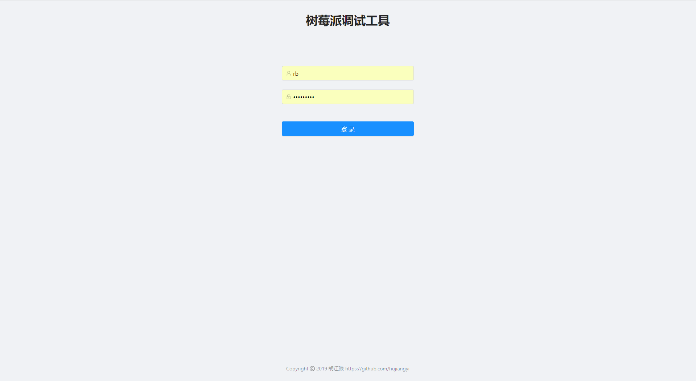
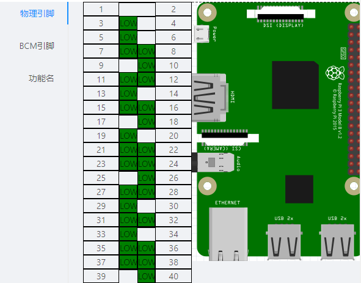
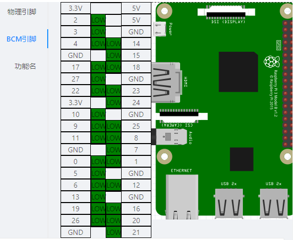
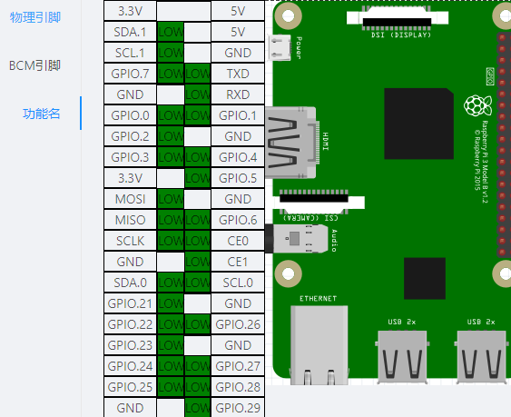
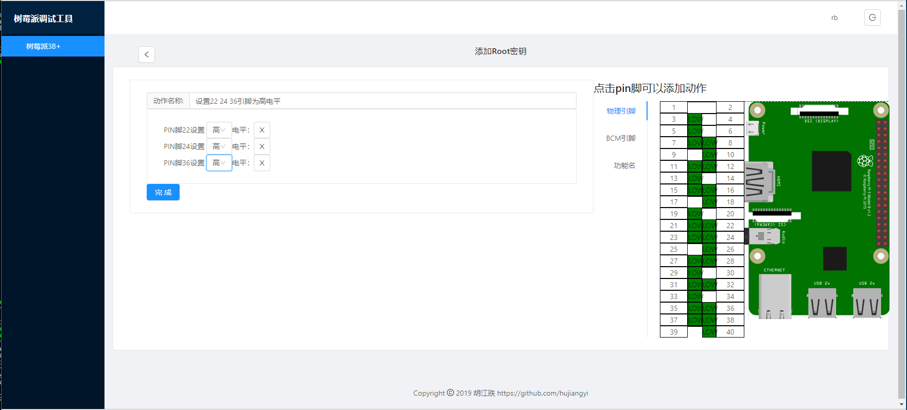
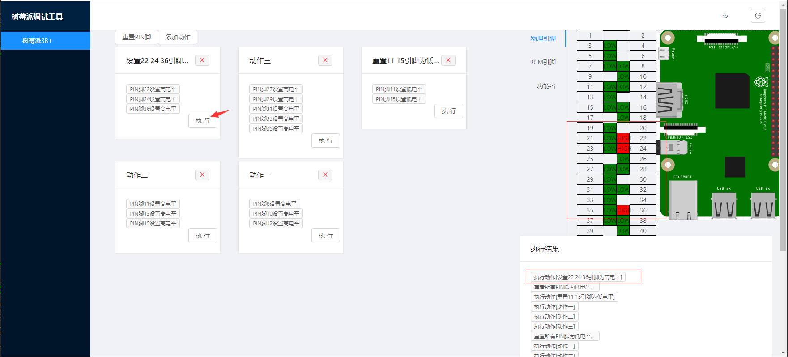

# 树莓派调试工具

此工具采用nodejs开发，使用umi + dva + express框架，主要功能是可以通过web页面直接控制树莓派的管脚，并可以通过新建动作集合来实现一些调试效果，比如点亮LED灯
开发此工具主要目的还是探索在树莓派上使用nodejs进行嵌入式开发的可行性尝试

## 效果展示











## 底层依赖
此项目使用pigpio库控制管脚

## 依赖

需要在树莓派上安装mongodb，默认使用apt安装的mongodb版本过低需要安装3.0.14版本，安装方法参考
```
https://andyfelong.com/2017/08/mongodb-3-0-14-for-raspbian-stretch/
```

初始化mongodb的用户表，用于系统登录，如果需要多用户或修改密码，请直接操作mongodb在user集合中添加或修改

```
use raspberry

db.user.insert({"userName":"rb","password":"","auth":"admin"})
```

建议升级node和npm的版本为最新版本

```
root@raspberrypi:/home/pi# node -v
v11.6.0
root@raspberrypi:/home/pi# npm -v
6.6.0
```

项目依赖安装

```
npm install
```

项目启动

```
node src/app_http.js
```

访问

```
http://raspberryid:8001/
```
登录
```
用户名 rb
密码 raspberry
```